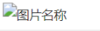

最近使用Hexo发现，引用本地图片的截图总是显示不出来。其效果为

网上的方法都是 安装hexo-asset-image插件，并修改_config.yml文件中post_asset_folder参数为true。

~~~ 
npm install https://github.com/CodeFalling/hexo-asset-image --save

~~~

尽管如此，也解决问题，在排除路径问题后，看到一篇博客说hexo-asset-image需要修改代码，否则会出现bug，其方法是打开/node_modules/hexo-asset-image/index.js，将内容更换为下面的代码 

~~~ 
'use strict';
var cheerio = require('cheerio');

// http://stackoverflow.com/questions/14480345/how-to-get-the-nth-occurrence-in-a-string
function getPosition(str, m, i) {
  return str.split(m, i).join(m).length;
}

var version = String(hexo.version).split('.');
hexo.extend.filter.register('after_post_render', function(data){
  var config = hexo.config;
  if(config.post_asset_folder){
    	var link = data.permalink;
	if(version.length > 0 && Number(version[0]) == 3)
	   var beginPos = getPosition(link, '/', 1) + 1;
	else
	   var beginPos = getPosition(link, '/', 3) + 1;
	// In hexo 3.1.1, the permalink of "about" page is like ".../about/index.html".
	var endPos = link.lastIndexOf('/') + 1;
    link = link.substring(beginPos, endPos);

    var toprocess = ['excerpt', 'more', 'content'];
    for(var i = 0; i < toprocess.length; i++){
      var key = toprocess[i];
 
      var $ = cheerio.load(data[key], {
        ignoreWhitespace: false,
        xmlMode: false,
        lowerCaseTags: false,
        decodeEntities: false
      });

      $('img').each(function(){
		if ($(this).attr('src')){
			// For windows style path, we replace '\' to '/'.
			var src = $(this).attr('src').replace('\\', '/');
			if(!/http[s]*.*|\/\/.*/.test(src) &&
			   !/^\s*\//.test(src)) {
			  // For "about" page, the first part of "src" can't be removed.
			  // In addition, to support multi-level local directory.
			  var linkArray = link.split('/').filter(function(elem){
				return elem != '';
			  });
			  var srcArray = src.split('/').filter(function(elem){
				return elem != '' && elem != '.';
			  });
			  if(srcArray.length > 1)
				srcArray.shift();
			  src = srcArray.join('/');
			  $(this).attr('src', config.root + link + src);
			  console.info&&console.info("update link as:-->"+config.root + link + src);
			}
		}else{
			console.info&&console.info("no src attr, skipped...");
			console.info&&console.info($(this));
		}
      });
      data[key] = $.html();
    }
  }
});

~~~

其修改部分是将

~~~ 
if(!(/http[s]*.*|\/\/.*/.test(src)
             /^\s+\//.test(src)
            || /^\s*\/uploads|images\//.test(src)))

~~~

修改成

~~~ 
if(!/http[s]*.*|\/\/.*/.test(src) &&
			   !/^\s*\//.test(src)
~~~

问题得以解决，图片能够正常显示。

# 参考资料

[Ericam的CSDN博客]( https://blog.csdn.net/xjm850552586/article/details/84101345 )

 [离未罔两的CSDN博客]( https://blog.csdn.net/geek_xiong/article/details/100125470 ) 