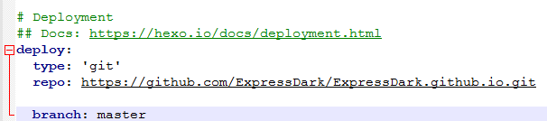

# 概述

Hexo是一个快速，简介的博客框架。能够使用Markdown解析文章，快速生成静态网页。

# 安装

安装Hexo之前需要安装[Node.js]( https://nodejs.org/en/ )和[Git]( https://git-scm.com/ )。安装完成后启动命令行安装Hexo。

~~~ 
$ npm install -g hexo-cli 
~~~

# 建站

在Hexo安装完成后，需要建立文件夹存放Hexo。

~~~
$ hexo init <folder>
$ cd <folder>
$ npm install
~~~

# 生成静态网页

首先，我们需要新建一个网站。

~~~ 
$ hexo init [folder]
~~~

如果没有设置folder，Hexo将默认在目前文件夹上建立网站。

然后，我们需要新建一篇文章。

~~~ 
$ hexo new [layout] <title>
~~~

如果没有设置layout，将使用_config.yml中的default_layout参数代替。

使用[Typora]( https://www.typora.io/ )写好的文章后，我们需要生成静态文件。

~~~ 
$ hexo generate
~~~

如果上面指令没有出现问题，并可以启动服务器。默认访问网站是： http://localhost:4000/ 。

~~~ 
$ hexo server
~~~

最后我们可以将静态文件部署到我们建立的静态网站上。

~~~ 
$ hexo deploy
~~~

# 利用GitHub进行部署

Hexo提供了快捷便利的一键部署功能。即$ hexo d。但是在部署之前，必须修改_config.yml文件参数。type改成git,repo改成GitHub中自己建立的仓库地址。

# 参考资料

[Hexo官网]( https://hexo.io/zh-cn/docs/ )

[码匠笔记搭建博客B站